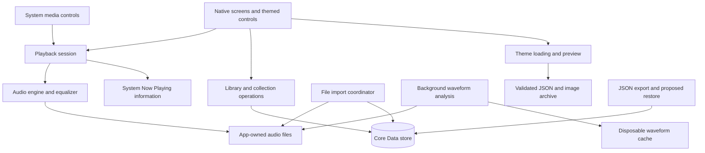

# Architecture Research

**Domain:** Local iOS audio, durable annotations, and imported visual skins
**Researched:** 2026-09-12
**Confidence:** Medium; proposed design grounded in documented APIs, without a compiled prototype.

## System Overview

The app needs one owner for playback state and persistent media identity shared by every screen. UI rendering remains native and concrete. Separate persistence, importing, decoding, and archive handling where the separation provides meaningful behavior or allows replacement.

The diagram is a recommended dependency structure, not a requirement to introduce a class for every box.

## Responsibilities

| Area | Owns | Does not own |
|------|------|--------------|
| App composition | Construction and injection of concrete dependencies | Business rules inside view setup |
| Native feature screens | Navigation, gestures, presentation, accessibility | Persistent-store saves or decoder lifetimes |
| Playback session | Current track, queue, intent, active passage, command ordering, published state | Theme assets or folder-tree expansion |
| Engine implementation | Decoding, sample scheduling, seeking, processing graph, EQ, audio callbacks | Playlist persistence or screen state |
| Library storage | Track identity, folder records, paths, import/move reconciliation | System media controls |
| Collection persistence | Moments, notes, favorites, playlist entries, presets | Audio file contents |
| Import operation | Scoped source access, staging, copying, verification, progress, recovery | Entire-file PCM buffering |
| Waveform analysis | Background chunk decoding and versioned peak caches | Real-time playback transport |
| Theme loading | Archive validation, supported schema, fallback values, preview/apply | Executable plugins or business logic |
| Diagnostics | Structured errors and optional bounded file logging/export | Blocking the main actor or audio render thread |

Keep protocols narrow and tied to external seams. If the concrete type can implement a needed interface directly, do that. A service must contain actual coordination or transformation rather than mirror another class's methods.

## Proposed Source Organization

- `App/`: entry point and dependency composition.
- `Feature/Library/`, `Feature/Player/`, `Feature/Moment/`, `Feature/Playlist/`, `Feature/Equalizer/`, `Feature/Settings/`: native screens grouped by user capability.
- `Domain/`: portable model values, timeline rules, and collection behavior.
- `Audio/`: engine integration, session control, system-media integration, waveform analysis.
- `Persistence/`: records, queries, and migrations.
- `Import/`: directory and file importing with durable recovery state.
- `Theme/`: schema, validation, assets, and native theme-aware components.
- `Backup/`: export schema, media-reference matching, and restore if approved.
- `Diagnostic/`: error records and file export.

Use the repository's Swift naming and documentation rules. Shared limits, frequency definitions, schema versions, and timeout values have one source of truth.

## Persistent Data Model

| Record | Important data | Reason |
|--------|----------------|--------|
| Track | Stable UUID, folder ID, basename, metadata, duration, media fingerprint, storage locator | Renaming or moving must not change what a moment references. |
| Folder | Stable UUID, parent folder ID, display name | Tree shape and names must not be inferred from an unstable sort order. |
| Moment | Stable UUID, track ID, start time, optional end time, one note, creation/update times | Represents both point bookmarks and passages without separate note records for endpoints. |
| Playlist | Stable UUID, name | Playlist identity survives rename. |
| Playlist entry | Stable entry UUID, playlist ID, track ID, order value | Supports ordered entries and, if desired, intentional duplicates. |
| Song favorite | Track ID and optional creation time | Distinct from timestamp and passage favorites. |
| EQ preset | UUID, name, versioned filter values and preamp | Presets must describe frequencies and filters, not assume an undocumented slider-array order. |
| Import operation | Operation ID, staging destination, status, item outcomes | Recover or clean up interrupted imports without losing committed items. |

Propose integer milliseconds for portable stored times, with validation against actual decoded duration. Convert to the decoder's native frame positions at playback boundaries. The source recording timeline is authoritative: passage-relative decoder positions must be translated back before updating markers or system playback information. The exact precision and tolerance need measurement in the audio experiment.

A content digest can help recognize the same bytes after re-import, but it is not the track's primary ID. Different encodings or edited metadata can change bytes. Do not automatically attach old notes to a file merely because its name and duration look similar.

## Playback and Moment Flow

1. A view or system command sends a playback intent to the shared session.
2. The session resolves the intended track and validates the requested position or range.
3. It cancels superseded preparation, configures the engine, and establishes the intended start before rendering audio.
4. Decoder callbacks are translated into one current state, then published on the UI actor.
5. System metadata is refreshed on track, rate, state, or position changes.
6. Persisted resume state is written at bounded intervals and lifecycle transitions without blocking audio.

Rapidly tapping different moments can leave asynchronous preparation in flight. Use a request identity or cancellation mechanism so completion for an earlier item cannot replace the newest selection. This is app coordination logic that justifies a session layer.

The revised default uses Apple's audio engine and native scheduling, adding only reviewed official decoder sources for measured codec gaps. Centralize graph changes and audio-session lifecycle handling, and publish UI state on the main actor. Use the appropriate completion callback semantics when scheduling segments or buffers; scheduling completion is not automatically the moment the listener has heard the final sample. [Apple segment scheduling](https://developer.apple.com/documentation/avfaudio/avaudioplayernode/schedulesegment(_:startingframe:framecount:at:completionhandler:))

The final passage-end policy is still pending. Keep stored region data separate from active playback policy so choosing stop, continue, or repeat does not require a new persistence schema.

## Files and Import Recovery

Use the system document picker for source access, then copy into managed persistent storage while retaining relative hierarchy. Scoped access has a lifetime and can fail; coordinate reads and end the access when finished. [Apple directory-access guidance](https://developer.apple.com/documentation/uikit/providing-access-to-directories)

Recommended import flow: enumerate without relying on provider order; stage each copy; validate completion; move into its managed destination; save the corresponding persistent record; reconcile unfinished operations at next launch. File changes and persistent-store saves are not one shared atomic operation, so staging and an operation record must bridge a crash between them.

Plan a clear collision policy and partial-result report. Deleting an original source after successful import must not break the imported copy. Waveform caches are disposable; imported music and user-created notes are not.

Files needed for playback after lock need an appropriate protection class. Apple's complete-until-first-authentication option permits subsequent access after the first unlock, even if the device is locked again. Apply and verify the chosen policy for audio plus any database files needed to advance tracks. [Apple file protection](https://developer.apple.com/documentation/foundation/fileprotectiontype/completeuntilfirstuserauthentication)

## Waveform and Long-File Performance

Decode bounded chunks in a separate analysis operation and reduce them into min/max or peak buckets. Store several useful resolutions keyed by media identity, file revision, and analysis version. Render only visible detail; do not create a native view per sample. Background completion must not overwrite a newer track's display.

The cache should support overview navigation and local precision around a selected time. Keep playback available while analysis is pending, expose meaningful progress, and stop obsolete analysis when the input disappears or the job is canceled. These are proposed implementation choices for multi-hour mixes, not established performance measurements.

## Themes

Keep one versioned theme schema used by the built-in theme, import, validation, and base-theme export. It should reference assets by relative archive paths and expose semantic roles such as page background, control surface, selected item, played waveform, unplayed waveform, and moment marker.

Archive intake should reject absolute paths, parent traversal, symlinks, duplicate destination paths, unsupported required schema versions, excessive extracted data, and excessively large decoded images. Validate and stage before switching the active theme. Preserve a known-good built-in fallback and an accessible way to reset it. These checks follow from accepting user-supplied archives; ZIPFoundation supplies archive operations, while the app defines allowed content. [ZIPFoundation](https://github.com/weichsel/ZIPFoundation)

User selection of layout-changing themes would require a bounded schema for arrangements, control slots, and supported sizing. Styling-only themes need less machinery. Do not decide that branch before the pending answer.

## JSON Export and Proposed Restore

Export app data in a versioned document with explicit IDs and units. Include playlists and order, song favorites, moments and notes, EQ presets, settings, and portable media references. The JSON does not contain music bytes or skin images; explain how those separate files accompany a backup. Base-skin ZIP export is a different operation.

If restore is accepted, parse and validate into a staging representation, show a summary, and apply the chosen merge/replace policy through a controlled persistent-store save. Detect repeated imports by stable IDs. Preserve unresolved media references as visible items needing reconnection; do not silently discard annotations. Keep the export model separate from managed objects so store migrations do not accidentally break backup compatibility.

## Verification Priorities

- Build and install a minimal player through the chosen macOS route.
- Verify the declared format matrix and long-file seeking.
- Verify moment references after import, rename, move, relaunch, and proposed backup restore.
- Test rapid moment switching and passage timeline offsets.
- Test lock-screen next/seek, audio interruptions, unplugged headphones, and EQ persistence across route changes.
- Measure waveform memory and responsiveness on representative older hardware or record the limits of simulator-only evidence.
- Test invalid archives, interrupted imports, and disk-full recovery with meaningful fixtures.

No runtime behavior described here has been verified on this Windows workstation.
